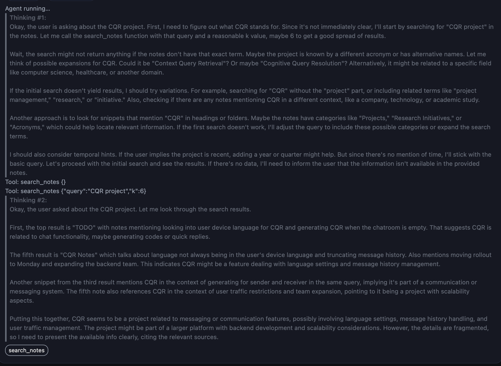

# Local Notes: Privacy-Focused RAG + Agentic LLM Chat for Apple Notes

<p align="center">
  
  
  
</p>

Chat with your notes locally using FAISS + Whoosh (RRF) and a local (Ollama) or cloud LLM. 
Local Notes is a private, local-first semantic search and Retrieval-Augmented Generation (RAG) tool for your Apple Notes. Notes are retrieved using AppleScript (no cloud). Text is embedded locally with SentenceTransformers and indexed with FAISS via LangChain for fast semantic queries. We use LangChain's SemanticChunker to split text into meaningful chunks.

## Table of Contents

- [Features](#features)
- [Quick Start](#quick-start)
- [Agent Mode (Qwen-Agent)](#agent-mode-qwen-agent)
- [Web UI](#web-ui)
- [Local LLM with Ollama](#local-llm-with-ollama)
- [Architecture](#architecture)
- [Indexing Details](#indexing-details)
- [CLI Indexing Progress](#cli-indexing-progress)
- [API Endpoints](#api-endpoints)
- [Configuration](#configuration)
- [Troubleshooting](#troubleshooting)
- [Security & Privacy](#security--privacy)
- [License](#license)

No data leaves your machine.

## Features
- **Apple Notes source** via AppleScript (no account credentials needed)
- **Local embeddings** with `sentence-transformers` (LangChain `HuggingFaceEmbeddings`)
- **FAISS semantic search** (LangChain)
- **Semantic chunking** with LangChain `SemanticChunker`
- **Hybrid retrieval**: FAISS (vector) + Whoosh BM25F (lexical with field boosts) via Reciprocal Rank Fusion
- **Streaming RAG** answers with live citations ([n]) and Markdown rendering
- **Web UI** (ChatGPT-like) with conversation history, source chips, inline snippet expand + copy
- **Web UI reindexing progress (SSE)** with a Reindex overlay (scan/plan/fetch/embed/save phases)
- **Conversations** persisted in SQLite (`conversations.db`) with citations stored per message
- **Stable IDs** in metadata and citations: `doc_id`, `chunk_id` so citations survive re-indexing or title changes
- **Embedding cache** (SQLite) avoids re-embedding unchanged text
- **Incremental indexing** with change detection and optional `--since` filter
- **Indexing progress in CLI** with Rich progress bars (notes, chunks)
- **Simple CLI**: `index`, `query`, and `ask` (streaming by default)
- **Privacy-first**: default local LLM via Ollama; can switch to OpenAI
- **Extensible datasources**

## Requirements
- macOS with Apple Notes app
- Python 3.10+
- `uv` for dependency management (install: `curl -LsSf https://astral.sh/uv/install.sh | sh` and restart shell)
- Permissions to allow Terminal/iTerm to automate Notes (System Settings > Privacy & Security > Automation / Accessibility)
- (Optional, for local LLM) Ollama installed and running for best privacy

## Quick Start

1. Create and activate a virtual environment with `uv` and install dependencies:

```bash
uv venv
source .venv/bin/activate
uv pip install -e .
```

2. Index your Apple Notes (first run may take a while):

```bash
python -m local_notes.cli index apple-notes --store-dir ./data/index
# Tip: incremental is on by default; to force a full rebuild use --no-incremental
# Tip: only recent changes
# python -m local_notes.cli index apple-notes --store-dir ./data/index --since "2025-09-01"
```

3. Start the Web UI (Chat):

```bash
uvicorn local_notes.server:app --reload --port 8000
# then open http://127.0.0.1:8000/
```

In the header, use the gear icon for settings and the "Reindex" button to rebuild the index with a live progress overlay.

Agent Mode (Qwen-Agent) is ON by default. You can toggle it at the top right of the chat. When ON, the agent plans tool usage, shows a thinking timeline, and streams a citations-only set of source chips as it references [n] in the answer.

4. (Optional) Ask from the CLI instead of the UI:

```bash
python -m local_notes.cli ask "summarize my postgres setup steps" --k 6
# Streaming is on by default. Use --no-stream for a single final answer.
```

## Architecture

At a high level, Local Notes consists of a data ingestion/indexing pipeline, a retrieval/generation service layer, a FastAPI server that exposes both API and a Web UI, and a small SQLite store for conversations and citations.

### Components

- **Data source (`local_notes/datasources/`)**
  - Reads Apple Notes via AppleScript.
  - Produces `Document` objects with `id`, `title`, `source`, `metadata`, and full `text`.

- **Indexing (`local_notes/indexing/pipeline.py`)**
  - Splits text with LangChain `SemanticChunker`.
  - Embeds with `HuggingFaceEmbeddings` wrapped by `CachedEmbeddings` (SQLite cache) to avoid recomputation.
  - Stores vectors in FAISS and metadata per chunk:
    - Stable IDs: `doc_id`, `chunk_id`
    - Also `title`, `source`, `chunk`, `doc_hash`, plus any datasource metadata
  - Incremental by default: only changed docs (by `doc_hash`) are re-indexed.

- **Service layer (`local_notes/service.py`)**
  - Hybrid retrieval (vector + lexical) with Reciprocal Rank Fusion.
  - MMR/Hybrid diversity for better coverage in `search_index()` and RAG.
  - Builds prompts and streams tokens from your chosen provider (Ollama/OpenAI).
  - Emits SSE events in classic mode: `sources` (all), `citations` (cited-only), `delta`, `done`.

- **Server (`local_notes/server.py`)**
  - FastAPI endpoints: `/search`, `/ask/stream`, and conversation CRUD + `/conv/{id}/ask/stream`.
  - Serves Web UI static assets at `/` and `/static`.

- **Web UI (`local_notes/web/`)**
  - Chat-like interface with streaming answers, live citations, snippet chips (expand/copy), settings.
  - Agent Mode ON by default: shows tool calls, a thinking timeline, and citations-only chips (chips appear only when the answer cites [n]).
  - Persists settings in localStorage.

- **Conversations store (`local_notes/storage/conversations.py`)**
  - SQLite DB with tables `conversations` and `messages`.
  - Saves assistant messages and citations (including `doc_id`, `chunk_id`).

## Data Location
Default index directory: `./data/index/`

Files created:
- `index.faiss` – FAISS index
- `index.pkl` – LangChain store metadata
- `emb_cache.sqlite` – SQLite embedding cache keyed by (model, md5(content))

Conversations database (web UI):
- `./data/conversations.db`

Delete these to reset state.

## Extending Data Sources
Implement `local_notes.datasources.base.DataSource` and register in the CLI. See `local_notes/datasources/apple_notes.py` for a reference implementation.

## Web UI

Start the API server and open the chat UI:

```bash
ollama serve
ollama pull qwen3:8b
uvicorn local_notes.server:app --reload --port 8000
# then open http://127.0.0.1:8000/
```

Web UI highlights (Chat view):
  - **Streaming** assistant messages with **live citations**; chips show snippet on hover.
  - **Click chips** to expand full snippet inline; **Copy** snippet.
  - **Assistant toolbar** on each answer: Copy Answer, Expand All, Collapse All.
  - **Agent Mode** (default ON):
    - Tool calls surface as trace lines and chips.
    - Thinking timeline streams incremental thoughts.
    - Source chips are shown only when actually cited in the answer.
  - **Settings** gear toggles controls (Provider, Model, Top K).
  - **Prefer Recent** slider biases retrieval toward newer chunks.
  - **Reindex** button shows a progress overlay with phases (Scan, Plan, Fetch, Embed, Save). You can Cancel while running.
  - **Conversations** auto-saved; citations persisted with stable IDs.

## Local LLM with Ollama

Ollama is the default LLM runtime for the `ask` command.

```bash
# Install (macOS)
brew install ollama

# Start service
ollama serve

# Pull a recommended model (9B default)
ollama pull gemma2   # default in this app
# or a faster, smaller variant
ollama pull gemma2:2b

# Ask (uses the default model unless overridden by --llm-model)
python -m local_notes.cli ask "..."
```

You can override the default with `--llm-model` or set an env var:

```bash
export OLLAMA_MODEL=gemma2

## API Endpoints

Served by FastAPI when you run `uvicorn` (see examples in [Quick Start](#quick-start)):

- `GET /` – Web UI (served static)
- `GET /search` – Search with hybrid retrieval
  - Query params: `q`, `k`, `max_chars`, `store_dir`, `embed_model`
- `POST /ask/stream` – SSE streaming for answers (no conversation)
- `GET /conv` – List conversations
- `POST /conv` – Create conversation `{ id, title }`
- `GET /conv/{id}/messages` – Get messages (oldest→newest)
- `POST /conv/{id}/ask/stream` – SSE streaming tied to a conversation; persists user + assistant with citations
- `POST /index/stream` – SSE stream for indexing progress (used by Web UI Reindex overlay)
- `GET /conv/{id}/export` – Export conversation + messages
- `POST /conv/import` – Import conversation
- `DELETE /conv/{id}` – Delete conversation

## Configuration

You can set defaults via environment variables to avoid repeating flags:

```bash
# Default local LLM model for `ask` (Ollama)
export OLLAMA_MODEL=gemma2          # or gemma2:2b, gemma3:12b-it-qat, llama3.1, etc.

# Use OpenAI instead (for `ask` with --provider openai)
export OPENAI_API_KEY=sk-...

# Optional: choose a different index directory by default (used in examples)
# Not strictly required since the CLI always accepts --store-dir

# Recency bias default (0.0–1.0) used by hybrid retrieval when UI slider is not provided
export LOCAL_NOTES_RECENCY_ALPHA=0.1
```


## OpenAI (optional)

To use OpenAI for the `ask` command:

```bash
export OPENAI_API_KEY=... 
python -m local_notes.cli ask "..." --provider openai --llm-model gpt-4o-mini
```

## Troubleshooting
- **AppleScript returns 0 notes**
  - Open the Notes app once manually and ensure you have at least one account with notes.
  - Check Automation permissions: System Settings > Privacy & Security > Automation. Allow your Terminal/IDE to control Notes.

- **Ollama: server not responding**
  - Start the server: `brew services start ollama` or run `ollama serve` in a terminal.
  - Verify: `curl http://localhost:11434/api/tags` should return JSON.

- **Ollama: pull model manifest: file does not exist**
  - Use valid tags. For Gemma 2, common tags are `gemma2` (9B default) and `gemma2:2b`.
  - Example: `ollama pull gemma2` or `ollama pull gemma2:2b`.

- **OpenAI setup**
  - Export `OPENAI_API_KEY` and use `--provider openai`.

- **Chunk boundaries look odd in snippets**
  - Increase retrieval depth `--k` or display length `--max-chars` in `query`.

- **Streaming text looks oddly formatted**
  - The UI renders Markdown with GFM and normalization, but some model outputs collapse bullets without newlines. Try sending again or adjust the prompt; we normalize common cases.

- **Conversation messages blank after streaming**
  - We now persist the assistant message before emitting `done` and finalize bubbles client-side without refresh. Hard-refresh the UI to load the latest scripts.

## Indexing Details

- **Stable IDs in metadata**
  - `doc_id` and `chunk_id` added per chunk. Citations store these so they are stable across re-indexes.

- **Embedding Cache**
  - SQLite cache (`emb_cache.sqlite`) avoids recomputation. Keys: `(model, md5(text))`.

- **Incremental Indexing**
  - We md5-hash full note content (`doc_hash`) and only re-embed changed notes; unchanged chunks are retained. `--since` limits to recently modified notes.

- **Hybrid Retrieval**
  - Vector similarities fused with a lexical ranker using Reciprocal Rank Fusion.
  - **Whoosh BM25F** with field boosts: `title` (x3), `heading` (x2), `content` (x1), `folder` (x0.5). The Whoosh index is stored at `./data/index/whoosh/`.
  - A small recency bonus is applied when `updated_at` is available.

## CLI Indexing Progress

The `index` command shows progress bars for notes and chunks:

```bash
python -m local_notes.cli index apple-notes --store-dir ./data/index

Listing Apple Notes metadata...
Notes needing body fetch: 609
Upserting 609 notes into index...
⠇ Notes  ━━━━━━━━━━━━━╸━━━━━━━━━━━━━━━━━━━━━━━━━━ 209/609  0:01:20 0:02:24
⠇ Chunks ━━━━━━━━━━━━━━━━━━━━━━━━━━━━━━━━━━━━━━━━ 275/None 0:01:20        
```

Progress includes:
- Notes processed
- Chunks embedded (benefits from the embedding cache)
- Elapsed/remaining time (estimates)

## Security & Privacy
- All processing is local.
- No telemetry.
- You control the index files.

## License
MIT
